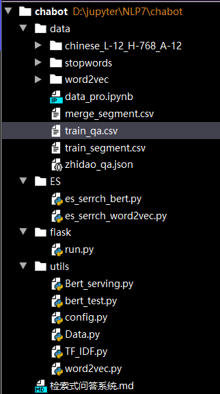

# 检索式问答系统

 数据：https://github.com/SophonPlus/ChineseNlpCorpus  金融问答数据

环境：ElasticSearch版本：6.2.4（需要提前安装好JDK）https://www.wandouip.com/t5i100355/




zhidao_qa数据太大了，暂时使用2万条数据。

ES模块通过**关键字**召回返回了top5的相似问题、ID和答案），然后对这top5计算score（**两句子长度之差blue**和**两个句向量的余弦相似度Similarity**打分得出）返回最佳。

最终效果：


## ElasticSearch

参考：https://www.jb51.net/article/166893.htm

简单理解就是提前建立N(取决于数据有多少句话)action，最后ES模块根据输入的一句话query里面的splwords、keywords去匹配所有action选出最佳的top5。详细见代码如何make_action。

```python
# 其中一个action
{'_index': 'text', 
'_type': 'text', 
'_source': {'context': '眼球突出，复视，视力减退到底是什么病在捣鬼', 
			'splwords': '眼球/突出/，/复视/，/视力/减退/到底/是/什么/病/在/捣鬼', 
			'keywords': '复视 捣鬼 减退 视力 眼球 突出', 
            'embeding': [0.17751333117485046, ...]}
```

## score

es_weight权重决定blue和Similarity，并最终求得score。

blue：通过两句子的长度打分，长度差的越远分数越低。

Similarity：通过两句向量余弦相似度求出。

gensim训练得到得的word2vec词向量最后求平均得到句子向量。

bert通过Bert_serving可直接得到句子向量。参考：https://blog.csdn.net/my__blog/article/details/103992493

## 暂时想到的可优化点

1、关键词的提取准确率是召回的关键，可以采用foolNLTK包将命名实体识别引入到关键词中。

2、对直接输入query直接top5召回可能不准确，好一点的做法是改写下query，调换语序等改写增强下输入数据。

3、简单暴力计算两相识度进行匹配效果可能不是很好，最好可以孪生语义网络来做深度语义匹配。


## 总结

通过ES简单搭建一个聊天机器人只是过了下大致流程，还有很多细节值得优化。


